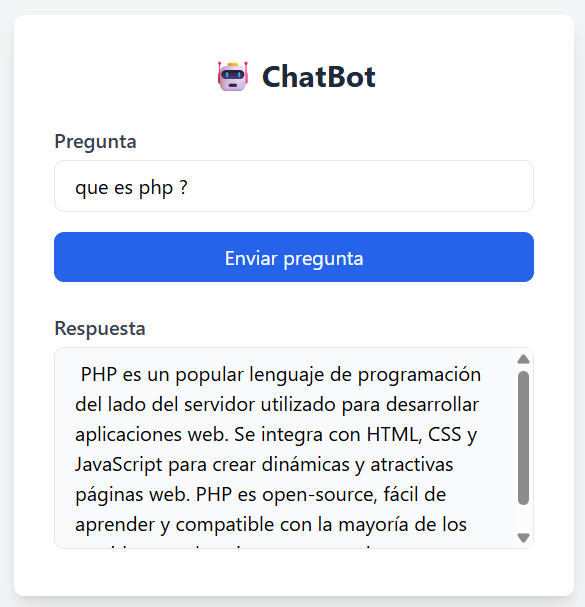

# ChatBot en PHP

Este es un ChatBot construido en PHP que permite enviar preguntas a un modelo de inteligencia artificial usando **OpenRouter**.  
El proyecto demuestra cómo consumir una API externa, separar la lógica de la vista y manejar un flujo completo entre una interfaz web y un backend.

Incluye además una IA falsa para pruebas sin conexión y soporta funcionamiento tanto en **modo web** como en **modo consola**.

---

## 🚀 Características

- Interfaz web para enviar preguntas.  
- Comunicación real con la API de OpenRouter.  
- Respuestas cortas, claras y directas.  
- Permite cambiar el modelo mediante variables de entorno.  
- Incluye una IA falsa para pruebas locales.  
- Compatible con modo web y modo consola.  

---

## 🛠️ Tecnologías utilizadas

- **PHP 8+**  
- **Composer**  
- **GuzzleHttp**  
- **Dotenv**  
- **TailwindCSS**  
- **OpenRouter API**

---

